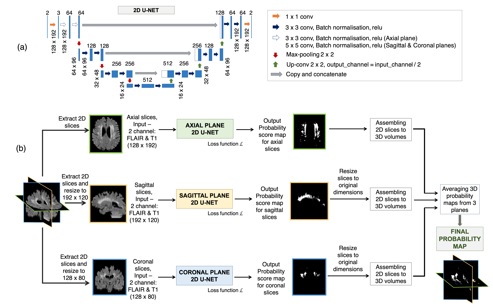

# Triplanar U-Net ensemble network (TrUE-Net) model 

## DL tool for white matter hyperintensities segmentation

### Preprint currently available at: https://www.biorxiv.org/content/10.1101/2020.07.24.219485v1.full

#### Software versions used:
Python > 3.6
PyTorch=1.5.0

## TrUE-Net architecture:



## To install the truenet tool
Clone the git repository into your loacal directory and run:
``` 
python setup.py install
```
To find about the subcommands available in truenet:
```
truenet --help
```
And for options and inputs for each sub-command, type:
```
truenet <subcommand> --help (e.g. truenet train --help)
```

## Running truenet

Triplanar ensemble U-Net model, v1.0.1
   
Subcommands available:
    - truenet train         Training a TrUE-Net model from scratch
    - truenet evaluate      Applying a saved/pretrained TrUE-Net model for testing
    - truenet fine_tune     Fine-tuning a saved/pretrained TrUE-Net model from scratch
    - truenet loo_validate  Leave-one-out validation of TrUE-Net model

### Training the TrUE-Net model

#### truenet train: training the TrUE-Net model from scratch, v1.0.1

```
Usage: truenet train -i <input_directory> -m <model_directory> [options] 


Compulsory arguments:
       -i, --inp_dir                 Path to the directory containing FLAIR and T1 images for training 
       -m, --model_dir               Path to the directory where the training model or weights need to be saved 
   
Optional arguments:
       -tr_prop, --train_prop        Proportion of data used for training [0, 1]. The rest will be used for validation [default = 0.8]
       -bfactor, --batch_factor      Number of subjects to be considered for each mini-epoch [default = 10]
       -loss, --loss_function        Applying spatial weights to loss function. Options: weighted, nweighted [default=weighted]
       -gdir, --gmdist_dir           Directory containing GM distance map images. Required if -loss=weighted [default = None]
       -vdir, --ventdist_dir         Directory containing ventricle distance map images. Required if -loss=weighted [default = None]
       -nclass, --num_classes        Number of classes to consider in the target labels (nclass=2 will consider only 0 and 1 in labels;
                                     any additional class will be considered part of background class [default = 2]
       -plane, --acq_plane           The plane in which the model needs to be trained. Options: axial, sagittal, coronal, all [default = all]
       -ilr, --init_learng_rate      Initial LR to use in scheduler [0, 0.1] [default=0.001]
       -lrm, --lr_sch_mlstone        Milestones for LR scheduler (e.g. -lrm 5 10 - to reduce LR at 5th and 10th epochs) [default = 10]
       -gamma, --lr_sch_gamma        Factor by which the LR needs to be reduced in the LR scheduler [default = 0.1]
       -opt, --optimizer             Optimizer used for training. Options:adam, sgd [default = adam]
       -bs, --batch_size             Batch size used for training [default = 8]
       -ep, --num_epochs             Number of epochs for training [default = 60]
       -es, --early_stop_val         Number of epochs to wait for progress (early stopping) [default = 20]
       -sv_mod, --save_full_model    Saving the whole model instead of weights alone [default = False]
       -cv_type, --cp_save_type      Checkpoint to be saved. Options: best, last, everyN [default = last]
       -cp_n, --cp_everyn_N          If -cv_type=everyN, the N value [default = 10]
       -da, --data_augmentation      Applying data augmentation [default = True]
       -af, --aug_factor             Data inflation factor for augmentation [default = 2]
       -v, --verbose                 Display debug messages [default = False]
       -h, --help.                   Print help message
```

### Testing the TrUE-Net model

#### truenet evaluate: evaluating the TrUE-Net model, v1.0.1

```
Usage: truenet evaluate -i <input_directory> -m <model_directory> -o <output_directory> [options]
   
Compulsory arguments:
       -i, --inp_dir                         Path to the directory containing FLAIR and T1 images for testing
       -m, --model_dir                       Path to the directory containing saved model or weights for testing (will not be considered if ptional argument -p=True)                                                                  
       -o, --output_dir                      Path to the directory for saving output predictions
   
Optional arguments:
       -p, --pretrained_model                Whether to use a pre-trained model, if selected True, -m (compulsory argument will not be onsidered) [default = False]
       -pmodel, --pretrained_model_name      Pre-trained model to be used: mwsc, ukbb [default = mwsc]
       -nclass, --num_classes                Number of classes in the labels used for training the model (for both pretrained models, -nclass=2) default = 2]
      -int, --intermediate                  Saving intermediate prediction results (individual planes) for each subject [default = False]
      -cv_type, --cp_load_type              Checkpoint to be loaded. Options: best, last, everyN [default = last]
       -cp_n, --cp_everyn_N                  If -cv_type = everyN, the N value [default = 10]
       -v, --verbose                         Display debug messages [default = False]
       -h, --help.                   Print help message
```

### Fine-tuning the TrUE-Net model

#### truenet fine_tune: training the TrUE-Net model from scratch, v1.0.1

```
Usage: truenet fine_tune -i <input_directory> -m <model_directory> -o <output_directory> [options]

Compulsory arguments:
       -i, --inp_dir                         Path to the directory containing FLAIR and T1 images for fine-tuning
       -m, --model_dir                       Path to the directory where the trained model/weights were saved
       -o, --output_dir                      Path to the directory where the fine-tuned model/weights need to be saved
   
Optional arguments:
       -p, --pretrained_model                Whether to use a pre-trained model, if selected True, -m (compulsory argument will not be considered) [default = False]
       -pmodel, --pretrained_model_name      Pre-trained model to be used: mwsc, ukbb [default = mwsc]
       -cpld_type, --cp_load_type            Checkpoint to be loaded. Options: best, last, everyN [default = last]
       -cpld_n, --cpload_everyn_N            If everyN option was chosen for loading a checkpoint, the N value [default = 10]
       -ftlayers, --ft_layers                Layers to fine-tune starting from the decoder (e.g. 1 2 -> final two two decoder layers)
       -tr_prop, --train_prop                Proportion of data used for fine-tuning [0, 1]. The rest will be used for validation [default = 0.8]
       -bfactor, --batch_factor              Number of subjects to be considered for each mini-epoch [default = 10]
       -loss, --loss_function                Applying spatial weights to loss function. Options: weighted, nweighted [default=weighted]
       -gdir, --gmdist_dir                   Directory containing GM distance map images. Required if -loss = weighted [default = None]
      -vdir, --ventdist_dir                 Directory containing ventricle distance map images. Required if -loss = weighted [default = None]
       -nclass, --num_classes                Number of classes to consider in the target labels (nclass=2 will consider only 0 and 1 in labels; 
                                             any additional class will be considered part of background class [default = 2]
      -plane, --acq_plane                   The plane in which the model needs to be fine-tuned. Options: axial, sagittal, coronal, all [default  all]
       -ilr, --init_learng_rate              Initial LR to use in scheduler for fine-tuning [0, 0.1] [default=0.0001]
       -lrm, --lr_sch_mlstone                Milestones for LR scheduler (e.g. -lrm 5 10 - to reduce LR at 5th and 10th epochs) [default = 10]
       -gamma, --lr_sch_gamma                Factor by which the LR needs to be reduced in the LR scheduler [default = 0.1]
       -opt, --optimizer                     Optimizer used for fine-tuning. Options:adam, sgd [default = adam]
       -bs, --batch_size                     Batch size used for fine-tuning [default = 8]
       -ep, --num_epochs                     Number of epochs for fine-tuning [default = 60]
       -es, --early_stop_val                 Number of fine-tuning epochs to wait for progress (early stopping) [default = 20]
       -sv_mod, --save_full_model            Saving the whole fine-tuned model instead of weights alone [default = False]
       -cv_type, --cp_save_type              Checkpoint to be saved. Options: best, last, everyN [default = last]
       -cp_n, --cp_everyn_N                  If -cv_type = everyN, the N value [default = 10]
       -da, --data_augmentation              Applying data augmentation [default = True]
       -af, --aug_factor                     Data inflation factor for augmentation [default = 2]
       -v, --verbose                         Display debug messages [default = False]
       -h, --help.                   Print help message
```

### Leave-one-out validation of TrUE-Net model

#### truenet loo_validate: leave-one-out validation of the TrUE-Net model, v1.0.1  
   
```
Usage: truenet loo_validate -i <input_directory> -o <output_directory> [options]
   
Compulsory arguments:
       -i, --inp_dir                         Path to the directory containing FLAIR and T1 images for fine-tuning
       -o, --output_dir                      Path to the directory for saving output predictions
   
Optional arguments:
       -tr_prop, --train_prop                Proportion of data used for training [0, 1]. The rest will be used for validation [default = 0.8]
       -bfactor, --batch_factor              Number of subjects to be considered for each mini-epoch [default = 10]
       -loss, --loss_function                Applying spatial weights to loss function. Options: weighted, nweighted [default=weighted]
       -gdir, --gmdist_dir                   Directory containing GM distance map images. Required if -loss = weighted [default = None]
       -vdir, --ventdist_dir                 Directory containing ventricle distance map images. Required if -loss = weighted [default = None]
       -nclass, --num_classes                Number of classes to consider in the target labels (nclass=2 will consider only 0 and 1 in labels;
                                             any additional class will be considered part of background class [default = 2]
       -plane, --acq_plane                   The plane in which the model needs to be trained. Options: axial, sagittal, coronal, all [default = all]
       -ilr, --init_learng_rate              Initial LR to use in scheduler for training [0, 0.1] [default=0.0001]
       -lrm, --lr_sch_mlstone                Milestones for LR scheduler (e.g. -lrm 5 10 - to reduce LR at 5th and 10th epochs) [default = 10]
       -gamma, --lr_sch_gamma                Factor by which the LR needs to be reduced in the LR scheduler [default = 0.1]
       -opt, --optimizer                     Optimizer used for training. Options:adam, sgd [default = adam]
       -bs, --batch_size                     Batch size used for fine-tuning [default = 8]
       -ep, --num_epochs                     Number of epochs for fine-tuning [default = 60]
       -es, --early_stop_val                 Number of fine-tuning epochs to wait for progress (early stopping) [default = 20]
       -int, --intermediate                  Saving intermediate prediction results (individual planes) for each subject [default = False]                                                                                  
       -da, --data_augmentation              Applying data augmentation [default = True]
       -af, --aug_factor                     Data inflation factor for augmentation [default = 2]
       -v, --verbose                         Display debug messages [default = False]
       -h, --help.                   Print help message
```

If you use the tool from this repository, please cite the following papers (journal publications to be updated, currently under review):

- Sundaresan, V., Zamboni, G., Rothwell, P. M., Jenkinson, M., & Griffanti, L. (2020). Triplanar ensemble U-Net model for white matter hyperintensities segmentation on MR images. BioRxiv. [DOI: https://doi.org/10.1101/2020.07.24.219485]
- Sundaresan, V., Zamboni, G., Dinsdale, N. K., Rothwell, P. M., Griffanti, L., & Jenkinson, M. (2021). Comparison of domain adaptation techniques for white matter hyperintensity segmentation in brain MR images. bioRxiv. [DOI: https://doi.org/10.1101/2021.03.12.435171]


