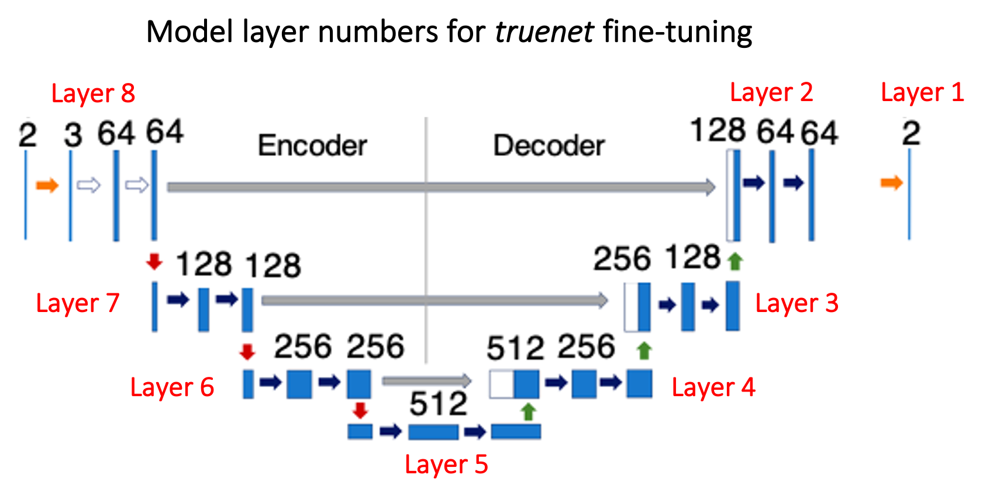
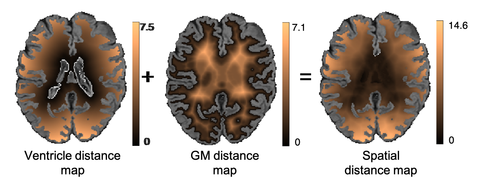

# Triplanar U-Net ensemble network (TrUE-Net) model 

## DL tool for white matter hyperintensities segmentation

## Contents
 - [citation](#citation)
 - [dependencies](#dependencies)
 - [installation](#installation)
 - [preprocessing](#preprocessing-and-preparing-data-for-truenet)
 - [simple usage](#simple-usage)
 - [advanced usage](#advanced-usage)
 - [technical details](#technical-details)

## Citation

If you use TrUE-Net, please cite the following papers:

- Sundaresan, V., Zamboni, G., Rothwell, P.M., Jenkinson, M. and Griffanti, L., 2021. Triplanar ensemble U-Net model for white matter hyperintensities segmentation on MR images. Medical Image Analysis, p.102184. [DOI: https://doi.org/10.1016/j.media.2021.102184] (preprint available at https://doi.org/10.1101/2020.07.24.219485)
- Sundaresan, V., Zamboni, G., Dinsdale, N. K., Rothwell, P. M., Griffanti, L., & Jenkinson, M. (2021). Comparison of domain adaptation techniques for white matter hyperintensity segmentation in brain MR images. bioRxiv. [DOI: https://doi.org/10.1101/2021.03.12.435171] (accepted in Medical Image Analysis, DOI to be updated soon).


## Dependencies
- Main truenet dependencies:
  - Python > 3.6
  - PyTorch=1.5.0
- Extra dependencies for pre-processing:
  - FMRIB software library (FSL) 6.0


## Installation
To install the truenet tool do the following:
1. Clone the git repository into your local directory.  
  - If you are not familiar with GitHub then the easiest way is to use the button labelled "<> Code" (right hand side, just above the file list) on the [main truenet page](/) and select the **Download ZIP** option. After you've done this, move the zip file to where you want to have truenet installed and unzip it.
3. Run:
``` 
python setup.py install
```
3. Use the instructions in this document ([simple usage](#simple-usage) is recommended for beginners)
4. More detailed lists of options for the subcommands are available in the command-line help:
```
truenet --help
```
And for options and inputs for each sub-command, type:
```
truenet <subcommand> --help (e.g. truenet train --help)
```
## Preprocessing and preparing data for truenet
T1-weighted and/or FLAIR images, or similar, can be used as inputs for truenet. A series of preprocessing operations need to be applied to the images. A script for performing these preprocessing steps has been provided: _prepare_truenet_data_ 

This script performs the following steps:
 - reorienting image to the standard MNI space (using FSL FLIRT)
 - skull-stripping (using FSL BET)
 - bias field correction (using FSL FAST)
 - T1-weighted images (or similar) need to be registered to the FLAIR (or whatever image was used to make the manual masks) using linear rigid-body registration (using FSL FLIRT).
 - creating a white matter mask, obtained from a dilated and inverted cortical CSF tissue segmentation (combined with other deep grey exclusion masks, using FSL FAST) and the _make bianca mask_ command in FSL BIANCA (Griffanti et al., 2016).

#### prepare_truenet_data
```
Usage: prepare_truenet_data <FLAIR_image_name> <T1_image_name> <output_basename>
 
The script prepares the FLAIR and T1 data to be used in FSL truenet with a specified output basename
FLAIR_image_name  	name of the input unprocessed FLAIR image
T1_image_name 	name of the input unprocessed T1 image
output_basename 	name to be used for the processed FLAIR and T1 images (along with the absolute path); 
                     output_basename_FLAIR.nii.gz, output_basename_T1.nii.gz and output_basename_WMmask.nii.gz will be saved
```

## Simple usage

There are multiple options in how truenet can be used, but a simple summary is this:
 - to segment an image you use the _evaluate_ mode
   - this requires an existing _model_ to be used, where a model is a network that has been trained on some dataset
   - you can use a _pretrained_ model that is supplied with truenet (see [below](#pretrained-models))
    - to use any of these pretrained models your images need to match relatively well to those used to train the model
   - alternatively, you can use a model that you or someone else has trained from scratch (using the _train_ mode of truenet)
   - another alternative is to take a pretrained model and _fine tune_ this on your data, which is more efficient than training from scratch (that is, it requires less data for training)

### Examples

## Advanced usage

### Modes of operation

Details of the different commands and their options are available through the command-line help

Triplanar ensemble U-Net model, v1.0.1

```  
Subcommands available:
    - truenet evaluate      Applying a saved/pretrained TrUE-Net model for testing
    - truenet fine_tune     Fine-tuning a saved/pretrained TrUE-Net model from scratch
    - truenet train         Training a TrUE-Net model from scratch
    - truenet loo_validate  Leave-one-out validation of TrUE-Net model
```

### Applying the TrUE-Net model (performing segmentation)

#### Pretrained models

 - Currently pretrained models, based on the [MWSC](linkhere) and UKBB [UK Biobank](linkhere) datasets, are available at: https://drive.google.com/drive/folders/1iqO-hd27NSHHfKun125Rt-2fh1l9EiuT?usp=share_link

 - These will be integrated more fully into FSL in the future, where these models will be available in the '$FSLDIR/data/truenet/Models' folder.
 
 - Currently, for testing purposes, you can download the models from the above drive link and place them into a folder of your choice. You then need to set the folder as an environment variable before running truenet. 
To do this, once you download the models into a folder, please type the following in the command prompt: 
```
export TRUENET_PRETRAINED_MODEL_PATH="/absolute/path/to/the/model/folder"
```
and then you can run truenet commands using the pretrained models as if they were integrated into FSL.

#### truenet evaluate: evaluating the TrUE-Net model, v1.0.1

```
Usage: truenet evaluate -i <input_directory> -m <model_directory> -o <output_directory> [options]
   
Compulsory arguments:
       -i, --inp_dir                         Path to the directory containing FLAIR and T1 images for testing
       -m, --model_name                      Model basename with absolute path (will not be considered if optional argument -p=True)                                                                  
       -o, --output_dir                      Path to the directory for saving output predictions
   
Optional arguments:
       -p, --pretrained_model                Whether to use a pre-trained model, if selected True, -m (compulsory argument will not be onsidered) [default = False]
       -pmodel, --pretrained_model_name      Pre-trained model to be used: mwsc, ukbb [default = mwsc]
       -nclass, --num_classes                Number of classes in the labels used for training the model (for both pretrained models, -nclass=2) default = 2]
       -int, --intermediate                  Saving intermediate prediction results (individual planes) for each subject [default = False]
       -cv_type, --cp_load_type              Checkpoint to be loaded. Options: best, last, everyN [default = last]
       -cp_n, --cp_everyn_N                  If -cv_type = everyN, the N value [default = 10]
       -v, --verbose                         Display debug messages [default = False]
       -h, --help.                           Print help message
```

### Fine-tuning an existing TrUE-Net model

#### truenet fine_tune: training the TrUE-Net model from scratch, v1.0.1
<p align="center">
       
</p>

```
Usage: truenet fine_tune -i <input_directory> -l <label_directory> -m <model_directory> -o <output_directory> [options]

Compulsory arguments:
       -i, --inp_dir                         Path to the directory containing FLAIR and T1 images for fine-tuning
       -l, --label_dir                       Path to the directory containing manual labels for training 
       -m, --model_dir                       Path to the directory where the trained model/weights were saved
       -o, --output_dir                      Path to the directory where the fine-tuned model/weights need to be saved
   
Optional arguments:
       -p, --pretrained_model                Whether to use a pre-trained model, if selected True, -m (compulsory argument will not be considered) [default = False]
       -pmodel, --pretrained_model_name      Pre-trained model to be used: mwsc, ukbb [default = mwsc]
       -cpld_type, --cp_load_type            Checkpoint to be loaded. Options: best, last, everyN [default = last]
       -cpld_n, --cpload_everyn_N            If everyN option was chosen for loading a checkpoint, the N value [default = 10]
       -ftlayers, --ft_layers                Layers to fine-tune starting from the decoder (e.g. 1 2 -> final two two decoder layers, refer to the figure above) 
       -tr_prop, --train_prop                Proportion of data used for fine-tuning [0, 1]. The rest will be used for validation [default = 0.8]
       -bfactor, --batch_factor              Number of subjects to be considered for each mini-epoch [default = 10]
       -loss, --loss_function                Applying spatial weights to loss function. Options: weighted, nweighted [default=weighted]
       -gdir, --gmdist_dir                   Directory containing GM distance map images. Required if -loss = weighted [default = None]
       -vdir, --ventdist_dir                 Directory containing ventricle distance map images. Required if -loss = weighted [default = None]
       -nclass, --num_classes                Number of classes to consider in the target labels (nclass=2 will consider only 0 and 1 in labels; 
                                             any additional class will be considered part of background class [default = 2]
       -plane, --acq_plane                   The plane in which the model needs to be fine-tuned. Options: axial, sagittal, coronal, all [default  all]
       -da, --data_augmentation              Applying data augmentation [default = True]
       -af, --aug_factor                     Data inflation factor for augmentation [default = 2]
       -sv_resume, --save_resume_training    Whether to save and resume training in case of interruptions (default-False)
       -ilr, --init_learng_rate              Initial LR to use in scheduler for fine-tuning [0, 0.1] [default=0.0001]
       -lrm, --lr_sch_mlstone                Milestones for LR scheduler (e.g. -lrm 5 10 - to reduce LR at 5th and 10th epochs) [default = 10]
       -gamma, --lr_sch_gamma                Factor by which the LR needs to be reduced in the LR scheduler [default = 0.1]
       -opt, --optimizer                     Optimizer used for fine-tuning. Options:adam, sgd [default = adam]
       -bs, --batch_size                     Batch size used for fine-tuning [default = 8]
       -ep, --num_epochs                     Number of epochs for fine-tuning [default = 60]
       -es, --early_stop_val                 Number of fine-tuning epochs to wait for progress (early stopping) [default = 20]
       -sv_mod, --save_full_model            Saving the whole fine-tuned model instead of weights alone [default = False]
       -cv_type, --cp_save_type              Checkpoint to be saved. Options: best, last, everyN [default = last]
       -cp_n, --cp_everyn_N                  If -cv_type = everyN, the N value [default = 10]
       -v, --verbose                         Display debug messages [default = False]
       -h, --help.                           Print help message
```

### Training the TrUE-Net model from scratch

#### truenet train: training the TrUE-Net model from scratch, v1.0.1

```
Usage: truenet train -i <input_directory> -l <label_directory> -m <model_directory> [options] 


Compulsory arguments:
       -i, --inp_dir                 Path to the directory containing FLAIR and T1 images for training 
       -l, --label_dir               Path to the directory containing manual labels for training 
       -m, --model_dir               Path to the directory where the training model or weights need to be saved 
   
Optional arguments:
       -tr_prop, --train_prop        Proportion of data used for training [0, 1]. The rest will be used for validation [default = 0.8]
       -bfactor, --batch_factor      Number of subjects to be considered for each mini-epoch [default = 10]
       -loss, --loss_function        Applying spatial weights to loss function. Options: weighted, nweighted [default=weighted]
       -gdir, --gmdist_dir           Directory containing GM distance map images. Required if -loss=weighted [default = None]
       -vdir, --ventdist_dir         Directory containing ventricle distance map images. Required if -loss=weighted [default = None]
       -nclass, --num_classes        Number of classes to consider in the target labels (nclass=2 will consider only 0 and 1 in labels;
                                     any additional class will be considered part of background class [default = 2]
       -plane, --acq_plane           The plane in which the model needs to be trained. Options: axial, sagittal, coronal, all [default = all]
       -da, --data_augmentation      Applying data augmentation [default = True]
       -af, --aug_factor             Data inflation factor for augmentation [default = 2]
       -sv_resume, --save_resume_training    Whether to save and resume training in case of interruptions (default-False)
       -ilr, --init_learng_rate      Initial LR to use in scheduler [0, 0.1] [default=0.001]
       -lrm, --lr_sch_mlstone        Milestones for LR scheduler (e.g. -lrm 5 10 - to reduce LR at 5th and 10th epochs) [default = 10]
       -gamma, --lr_sch_gamma        Factor by which the LR needs to be reduced in the LR scheduler [default = 0.1]
       -opt, --optimizer             Optimizer used for training. Options:adam, sgd [default = adam]
       -bs, --batch_size             Batch size used for training [default = 8]
       -ep, --num_epochs             Number of epochs for training [default = 60]
       -es, --early_stop_val         Number of epochs to wait for progress (early stopping) [default = 20]
       -sv_mod, --save_full_model    Saving the whole model instead of weights alone [default = False]
       -cv_type, --cp_save_type      Checkpoint to be saved. Options: best, last, everyN [default = last]
       -cp_n, --cp_everyn_N          If -cv_type=everyN, the N value [default = 10]
       -v, --verbose                 Display debug messages [default = False]
       -h, --help.                   Print help message
```

### Cross-validation of TrUE-Net model

#### truenet cross_validate: cross-validation of the TrUE-Net model, v1.0.1  
   
```
Usage: truenet cross_validate -i <input_directory> -l <label_directory> -o <output_directory> [options]
   
Compulsory arguments:
       -i, --inp_dir                         Path to the directory containing FLAIR and T1 images for fine-tuning
       -l, --label_dir                       Path to the directory containing manual labels for training 
       -o, --output_dir                      Path to the directory for saving output predictions
   
Optional arguments:
       -fold, --cv_fold                      Number of folds for cross-validation (default = 5)
       -resume_fold, --resume_from_fold      Resume cross-validation from the specified fold (default = 1)         
       -tr_prop, --train_prop                Proportion of data used for training [0, 1]. The rest will be used for validation [default = 0.8]
       -bfactor, --batch_factor              Number of subjects to be considered for each mini-epoch [default = 10]
       -loss, --loss_function                Applying spatial weights to loss function. Options: weighted, nweighted [default=weighted]
       -gdir, --gmdist_dir                   Directory containing GM distance map images. Required if -loss = weighted [default = None]
       -vdir, --ventdist_dir                 Directory containing ventricle distance map images. Required if -loss = weighted [default = None]
       -nclass, --num_classes                Number of classes to consider in the target labels (nclass=2 will consider only 0 and 1 in labels;
                                             any additional class will be considered part of background class [default = 2]
       -plane, --acq_plane                   The plane in which the model needs to be trained. Options: axial, sagittal, coronal, all [default = all]
       -da, --data_augmentation              Applying data augmentation [default = True]
       -af, --aug_factor                     Data inflation factor for augmentation [default = 2]
       -sv_resume, --save_resume_training    Whether to save and resume training in case of interruptions (default-False)
       -ilr, --init_learng_rate              Initial LR to use in scheduler for training [0, 0.1] [default=0.0001]
       -lrm, --lr_sch_mlstone                Milestones for LR scheduler (e.g. -lrm 5 10 - to reduce LR at 5th and 10th epochs) [default = 10]
       -gamma, --lr_sch_gamma                Factor by which the LR needs to be reduced in the LR scheduler [default = 0.1]
       -opt, --optimizer                     Optimizer used for training. Options:adam, sgd [default = adam]
       -bs, --batch_size                     Batch size used for fine-tuning [default = 8]
       -ep, --num_epochs                     Number of epochs for fine-tuning [default = 60]
       -es, --early_stop_val                 Number of fine-tuning epochs to wait for progress (early stopping) [default = 20]
       -int, --intermediate                  Saving intermediate prediction results (individual planes) for each subject [default = False]                                                                                  
       -v, --verbose                         Display debug messages [default = False]
       -h, --help.                           Print help message
```

## Technical Details

### TrUE-Net architecture:


### Applying spatial weights in the loss function:
We used a weighted sum of the voxel-wise cross-entropy loss function and the Dice loss as the total cost function. We weighted the CE loss function using a spatial weight map (a sample shown in the figure) to up-weight the areas that are more likely to contain the less represented class (i.e. WMHs).
<p align="center">
       
</p>


